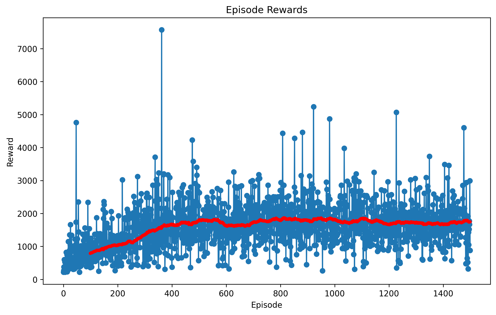
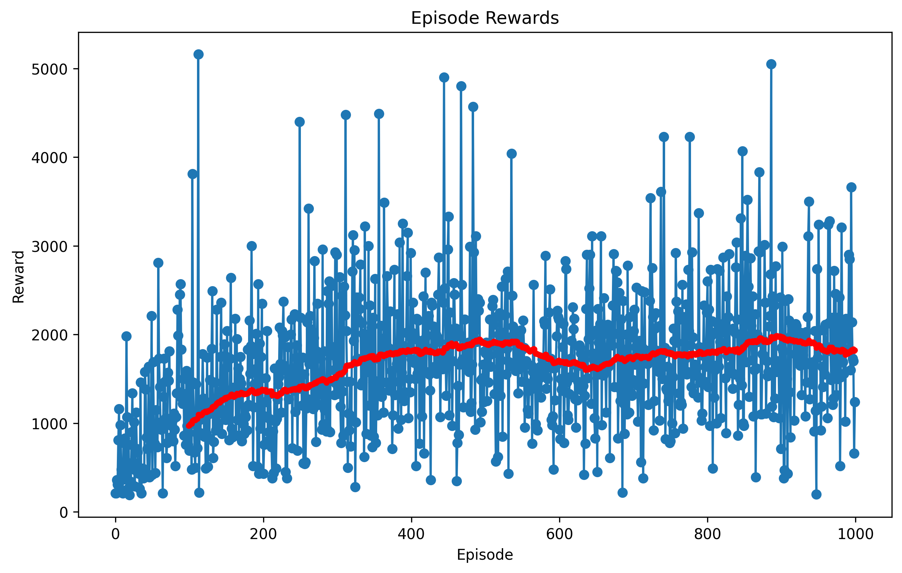
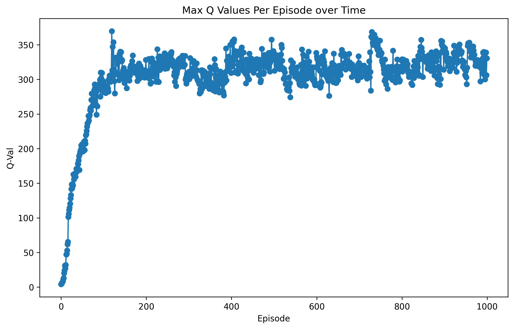
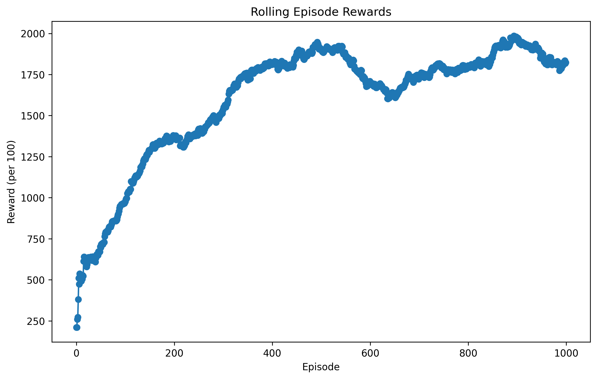
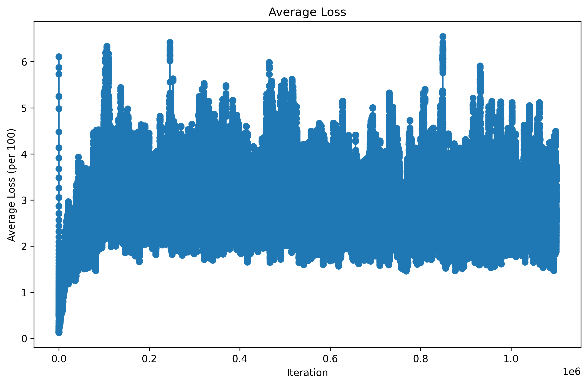
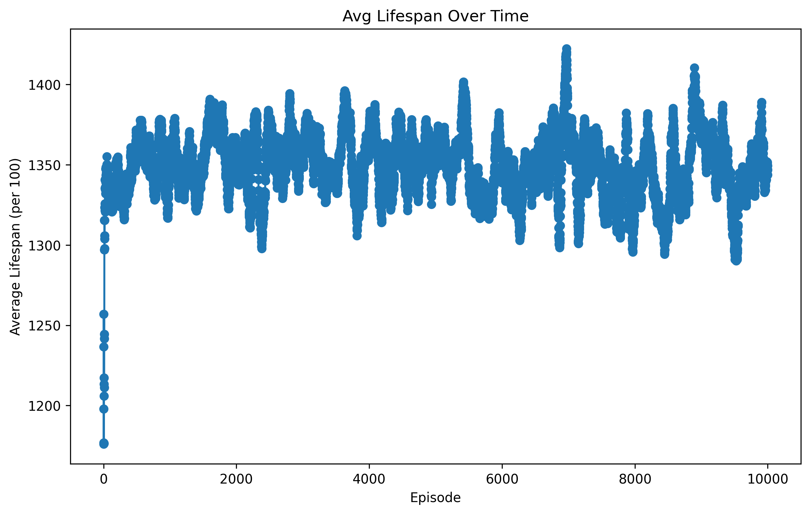

# MLDSRL

```
git clone https://github.com/davidwmcdevitt/MLDSRL
```
_____________________________________________

HW4 Submission - Federated Learning

_____________________________________________

Part 1
```
python MLDSRL/HW4/fedavg.py
```
Part 2
```
python MLDSRL/HW4/fedavg_distributed.py
```
Report: https://docs.google.com/document/d/1cgRGlaOCRhLXVbQCCI1M_jrQSrXmgreMIUHAYgwmn68/edit?usp=sharing
_____________________________________________

HW3 Submission

_____________________________________________

1. CartPole Submission
   
```
python MLDSRL/HW3/cartpole_dqn.py
```


500 Episodes Rollout Test:
Mean: 199.37
SD: 5.82

2. Ms. Pacman Submission

```
python MLDSRL/HW2/mspacman_dqn.py
```






500 Episodes Rollout Test:
Mean: 1803.74
SD: 669.7
_____________________________________________

HW2 Submission

_____________________________________________
   
1. CartPole Submission
   
```
python MLDSRL/HW2/cartpole_base.py
```


CartPole trains until a streak of 10 consecutive episodes with a duration greater than or equal to 195 steps is acheived. Algorithm is tested on 100 episodes. if The average value of those 100 episodes is greater than or equal to 195, then the problem has been solved. 

2. Pong Submission

```
python MLDSRL/HW2/pong_baseline_v2.py
```



_____________________________________________

HW1 Submission

_____________________________________________

1. CartPole Submission
   
```
python MLDSRL/HW1/cartpole.py
```


CartPole trains until a streak of 10 consecutive episodes with a duration greater than or equal to 195 steps is acheived. Algorithm is tested on 100 episodes. if The average value of those 100 episodes is greater than or equal to 195, then the problem has been solved. 

2. Pong Submission

```
python MLDSRL/HW1/pong.py
```


